**Affiliation:** Independent Researcher  
**ORCID:** [0009-0001-7267-0201](https://orcid.org/0009-0001-7267-0201)  
**Version:** 1.0.0  
**DOI:** [10.5281/zenodo.21860461](https://doi.org/10.5281/zenodo.21860461)  
**License:** [CC BY 4.0](https://creativecommons.org/licenses/by/4.0/)

# Abstract

Multi-token prediction (MTP) can accelerate autoregressive inference by
verifying draft tokens in parallel. Although intended to preserve the target
distribution, exact greedy behavior in a finite-precision quantized runtime
remains empirical. We evaluated QAT Q4_0 Gemma 4 12B instruction-tuned (dense)
and 26B-A4B instruction-tuned (mixture-of-experts) on one NVIDIA RTX 5070 Ti
using a pinned CUDA `llama.cpp` build, sweeping MTP off and maximum draft depths
N={1,2,3,4,6,8,12,16} over nine fixed performance prompts and a paired 200-item
objective suite. N=6 produced the highest measured aggregate decode throughput
for both models: 226.39 versus 89.20 tokens/s for 12B (2.54x) and 322.53 versus
169.58 tokens/s for 26B-A4B (1.90x). At N=6, however, only 112/200 and 118/200
outputs, respectively, were byte-identical to ordinary decoding. Objective
macro-score changes were -0.83 percentage points for both models, with paired
stratified-bootstrap 95% confidence intervals of [-4.17,+2.71] for 12B and
[-2.92,+0.83] for 26B-A4B; both cleared the prospectively frozen -5-point
non-inferiority margin as exploratory pilot evidence. Two post-hoc analyses
further showed that divergence was associated with longer ordinary-decoding
responses and that this negative association persisted within GSM8K, IFEval,
and MBPP, but non-randomized length and residual item/response confounding
preclude a causal per-token interpretation. They also showed a 12B performance
plateau: N={4,6,8,12} lay within 2.6% of the observed maximum, although only N=6
received the 200-item quality evaluation. Thus N=6 is the evidence-backed
high-throughput default in this tested stack, not a proven unique optimum; the
findings do not generalize to BF16, other GPUs, runtimes, workloads, or
concurrent serving.

# 1. Introduction

Autoregressive language-model decoding performs a sequential model evaluation
for each output token. Speculative decoding reduces this serial cost by asking
a faster draft mechanism to propose multiple future tokens, then verifying
those candidates with the target model in parallel. The original algorithms
are designed to preserve the target distribution [@leviathan2022speculative;
@chen2023speculative]. Multi-token prediction provides a compact, model-linked
drafter and has been reported to accelerate inference [@gloeckle2024multitoken].
Gemma 4 distributes MTP drafters for its model family and describes substantial
decoding speedups without quality change [@google2026gemma4mtp].

The deployment question is narrower and more practical: what happens when a
particular quantized target, quantized drafter, backend, and runtime are used
on a consumer GPU? “Lossless” can refer to an algorithmic sampling property,
but operators may also expect byte-identical greedy text. Quantized
matrix operations and different execution paths can change near-tied logits.
An upstream `llama.cpp` issue reports such divergence for quantized targets,
including Gemma 4 MTP [@llamacppissue25618]. This motivates separate tests of
speed, exact behavioral equivalence, and objective task quality.

This study makes five scoped contributions:

1. an operational separation of algorithmic losslessness, deterministic
   behavioral equivalence, and empirical task-quality equivalence;
2. a depth sweep for two QAT Q4_0 Gemma 4 models on a 16-GB-class RTX 5070 Ti;
3. sequence-level and token-level analysis of greedy-output divergence,
   including a clearly labeled post-review analysis of its association with
   response length;
4. paired objective scoring on four task families with a frozen
   non-inferiority rule; and
5. a reproducible artifact package containing raw outputs, logs, scripts,
   manifests, tables, and figures.

The aim is not to maximize a headline tokens/s number. It is to identify the
quality-constrained operating point for this machine and to state precisely
which forms of equivalence the evidence does and does not support.

# 2. Background

## 2.1 Three meanings of “lossless”

We distinguish three claims.

**Algorithmic losslessness** is a property of a speculative sampling method:
under its assumptions, the output distribution equals the target model's
distribution. **Deterministic behavioral equivalence** asks whether the exact
same greedy token sequence is obtained from two concrete runtime paths.
**Empirical task-quality equivalence** asks whether potentially different
strings retain the same measured usefulness on scored tasks. Neither of the
latter two follows automatically from the first in finite-precision software.

## 2.2 MTP and verification

MTP trains or supplies heads that predict several future tokens. During
inference a smaller drafter proposes a sequence, while the target verifies the
proposals in a batch. Speed depends on the cost of drafting and verification,
the number of accepted tokens, memory behavior, and prompt/output shape.
Larger N can expose more parallel work but can also waste more draft compute
after an early rejection. Therefore, the best N is an empirical workload and
implementation property, not a universal model constant.

## 2.3 Quantized local inference

Both targets and both MTP drafters in this study use Q4_0 GGUF artifacts. The
target and drafter therefore do not reproduce the source higher-precision
arithmetic exactly. We do not attempt to isolate whether observed divergence
comes from quantization, kernel order, KV/state management, verification logic,
or their interaction. That would require a higher-precision replication and
implementation-level tracing.

# 3. Related work

Leviathan et al. introduced speculative decoding with a proof-oriented account
of preserving the target distribution and reported 2--3x acceleration on
their evaluated system [@leviathan2022speculative]. Chen et al. independently
described speculative sampling using modified rejection sampling and reported
2--2.5x decoding speedup on a distributed 70B setting
[@chen2023speculative]. These results establish the algorithmic motivation but
not exact equivalence for this quantized runtime.

Gloeckle et al. studied multi-token prediction as a training objective and as
an inference accelerator [@gloeckle2024multitoken]. The Gemma 4 technical
report describes the broader dense and MoE model family
[@gemmateam2026gemma4], while the official MTP model card describes a smaller
draft model whose proposals are verified by the target
[@google2026gemma4mtp]. The local runtime is `llama.cpp`, whose speculative
decoding interface explicitly supports draft-MTP and tunable maximum draft
depth [@llamacpp2026].

The objective suite uses GSM8K mathematics [@cobbe2021gsm8k], MMLU-Pro
knowledge/reasoning [@wang2024mmlupro], verifiable instruction-following from
IFEval [@zhou2023ifeval], and executable MBPP programming tasks
[@austin2021mbpp]. The study does not claim to reproduce each benchmark's
canonical leaderboard protocol; it uses fixed paired subsets and documents
the scoring adaptations.

# 4. Research questions and hypotheses

- **RQ1 (acceleration):** Does a tested MTP condition improve paired median
  decode throughput by at least 20% without an increased request-failure rate?
- **RQ2 (depth):** Which tested N maximizes throughput, and does a lower-depth,
  lower-variance point qualify as conservative?
- **RQ3 (behavioral equivalence):** Are 100% of outputs byte-identical and
  target-token-identical to a reproducible ordinary-decoding baseline?
- **RQ4 (task quality):** Is the lower limit of a paired bootstrap 95% CI for
  macro score change greater than a frozen -5 percentage-point margin?
- **RQ5 (model association):** How do the two model/runtime combinations
  differ, without treating the dense/MoE distinction as a controlled causal
  intervention?

One verified divergence with a stable ordinary baseline falsifies exact
equivalence. Failure of the non-inferiority CI to clear -5 points yields an
inconclusive result rather than proof of harm.

# 5. Methods

## 5.1 Hardware, software, and models

Experiments ran on Ubuntu 24.04.1 LTS (kernel 6.17.0-40), an Intel Core
i7-11700 (8 physical cores, 16 logical CPUs), 125 GiB system memory, and an
NVIDIA GeForce RTX 5070 Ti. `llama.cpp` reported 15,841 MiB GPU memory. The
pinned runtime was commit `7ba604f1cb61cd14898138e9abc0b4ff2601f180`, built
in Release mode with GCC 13.3, CUDA architecture SM120, CUDA and Flash
Attention enabled. The server binary SHA-256 was
`1590bb2b1f9f704ed204fec890b2bb8cfaceb93bc2ca08dc3f70ef8053a0824a`.

The 12B target was 6,975,877,728 bytes and the 26B-A4B target was
14,439,361,440 bytes. Their SHA-256 digests, along with those of the 254-MB and
252-MB MTP drafters, are in `configs/environment.json`. Startup logs verified
full requested layer placement: 49/49 main and 5/5 draft layers for 12B;
31/31 main and 5/5 draft layers for 26B-A4B. Ollama was not used for inference;
the independent `llama-server` binary opened the stored model blobs directly.
The allocator reported 6,637.69 MiB of main-model device buffer plus 226.90
MiB of draft buffer for 12B, and 13,755.42 MiB plus 225.21 MiB for 26B-A4B.
These are component-buffer reports rather than independent peak process-VRAM
measurements.

NVML telemetry was unavailable because the loaded kernel module (595.71.05)
and user-space library (595.84) did not match. Consequently, GPU power,
temperature, clock, utilization, and independent peak-VRAM series could not be
recorded. CUDA execution remained functional, and placement was validated from
server logs. This prevents a complete thermal-confound assessment.

## 5.2 Fixed runtime settings

All main runs used context 8192, concurrency one, temperature 0, top-k 1,
fixed per-prompt seeds, Flash Attention, F16 target and draft KV, batch and
micro-batch 512, eight CPU threads, and full requested GPU offload. Model,
runtime, and protocol hashes were frozen before new outputs. Conditions were
started in deterministic randomized order, and one warm-up request per server
start was excluded.

## 5.3 Performance sweep

For each model, we tested MTP off and N in {1,2,3,4,6,8,12,16}, with p-min=0.
Nine distinct fixed prompts covered three input-length targets (approximately
256, 1,024, and 4,000 tokens; three prompts each). Each request forced 256
output tokens by ignoring EOS. The primary performance endpoint was the median
paired decode-rate ratio to OFF. Aggregate tokens divided by aggregate decode
time, prompt throughput, wall latency, time to first streamed content,
acceptance, and run-level variation were secondary measures. No valid run was
removed as an outlier.

## 5.4 Condition selection

The maximum-throughput point was the tested N with the highest aggregate
decode rate. A pre-specified conservative point required the smallest N within
95% of that maximum and a request-level coefficient of variation (CV) at most
10%. Neither model produced an eligible condition. Before inspecting quality
outputs, we therefore retained N=6 plus an explicitly exploratory
low-variance fallback: N=3 for 12B and N=4 for 26B-A4B.

## 5.5 Objective quality and equivalence

A deterministic 200-item sample contained 60 GSM8K test items, 60 MMLU-Pro
test items, 40 IFEval items, and 40 MBPP items. Each model ran ordinary
decoding twice (`off_a`, `off_b`) and both retained MTP conditions, giving
1,600 completed quality requests. GSM8K used normalized exact numeric answer;
MMLU-Pro used an exact final option label constrained to the grammar
`Final answer: [A-J]`; IFEval used the official Google Research
instruction-checking implementation; MBPP ran the reference tests in a
network- and filesystem-isolated Bubblewrap sandbox with CPU, memory, and wall
limits. Dangerous imports and calls were rejected by an AST pre-check. Scorer
fixtures included known pass and fail cases and all passed.

The MMLU-Pro measurement is constrained-choice accuracy, not a reproduction of
the benchmark's chain-of-thought protocol. Output budgets were 512 tokens for
GSM8K, 128 for constrained MMLU-Pro, 768 for IFEval, and 512 for MBPP. Smoke
testing exposed chat-channel and truncation problems; all corrections were
versioned before the full analyzed run and are disclosed in
`analysis/DEVIATIONS.md`.

Exact equivalence metrics were byte equality, target-token equality, common
prefix and first divergent token, normalized character Levenshtein similarity,
and token-length difference. Ordinary-decoding repeat agreement defined a
stable baseline subset. A divergent continuation was counted once per
sequence.

## 5.6 Statistical analysis

The primary quality score was the unweighted mean of the four family
accuracies. For each retained MTP condition, we computed the paired macro
difference and a task-stratified paired bootstrap 95% confidence interval with
10,000 resamples and seed 20260809. The frozen non-inferiority margin was -5
percentage points. Within each model, family-level paired changes used exact
McNemar tests with Holm correction. Because N=200 was resource-bounded rather
than prospectively powered for small effects, passing the margin is treated as
exploratory non-inferiority evidence, not definitive equivalence.

## 5.7 Negative controls and contamination diagnostics

The principal negative control was an independent OFF repeat. We also rotated
the option order for 20 MMLU-Pro items and compared the implied semantic answer
with the original order under OFF and N=6. Prompt duplicate and shared n-gram
diagnostics were run. Public benchmark exposure in the model's training data
cannot be ruled out, so absolute capability and state-of-the-art claims are
prohibited.

## 5.8 Post-review exploratory analyses

The first external review added two analyses; neither is part of the frozen
confirmatory protocol. First, for each retained MTP condition, we grouped the
200 quality pairs by the natural OFF-A output length (1--8, 9--32, 33--64,
65--128, or at least 129 target-token IDs) and calculated exact byte-match
rates. We also calculated Spearman association and a descriptive
Kaplan--Meier-like no-divergence curve in which exact pairs were censored at
their natural ending. Natural endings can be informative censoring, and task
family and response form are strongly confounded with length; the analysis
therefore cannot identify an independent or constant per-token divergence
probability.

Second, we resampled the nine matched performance prompts 100,000 times with
replacement (seed 20260809), recomputed aggregate decode rate at every tested
positive N, and recorded which N was fastest. We also bootstrapped the paired
median speed ratio between the observed best and runner-up depths. This
quantifies workload-sampling uncertainty only; it does not include fresh
repeated-run, thermal, or system-state variation.

Following a second external review, we partially addressed task-family
confounding without collecting new outputs. Within each model, retained
condition, and family, we calculated Spearman correlation between OFF-A length
and exact equality, with 20,000 pair-bootstrap resamples for 95% intervals.
Benjamini--Hochberg correction covered all 12 identifiable family comparisons;
MMLU-Pro was non-identifiable because every OFF output had five token IDs. We
also converted length to a within-family fractional rank, centered both that
rank and equality within family, and correlated the pooled residuals across
GSM8K, IFEval, and MBPP (N=140). This task-stratified statistic used 20,000
stratified bootstrap resamples, 100,000 within-family permutations, and BH
correction across four retained model/condition comparisons. It removes
between-family level differences but does not randomize length or eliminate
within-family item complexity, output-form, stopping, and truncation
confounding.

Finally, we summarized the 12B conditions at least 95% as fast as the observed
grid maximum, reusing the prospectively specified speed threshold. This is a
descriptive performance band, not an equivalence test. Conditions without the
200-item objective run cannot inherit N=6's quality result.

# 6. Performance results

All 162 planned main performance requests were valid (81 per model). Table 1
shows the selected rows; complete results appear in
`tables/performance_by_depth.md`.

| Model | N | Aggregate decode tok/s | Paired median speedup (95% bootstrap CI) | CV | Acceptance | Median wall ms | Median TTFC ms |
|---|---:|---:|---:|---:|---:|---:|---:|
| 12B | OFF | 89.20 | -- | 0.019 | -- | 3348 | 526 |
| 12B | 3 | 203.91 | 2.261 [2.142, 2.468] | 0.070 | 0.717 | 1800 | 454 |
| 12B | 6 | **226.39** | **2.497 [2.266, 3.054]** | 0.155 | 0.577 | 1985 | 518 |
| 26B-A4B | OFF | 169.58 | -- | 0.027 | -- | 1847 | 369 |
| 26B-A4B | 4 | 300.92 | 1.789 [1.606, 1.968] | 0.098 | 0.730 | 1300 | 367 |
| 26B-A4B | 6 | **322.53** | **1.860 [1.701, 2.202]** | 0.122 | 0.706 | 1227 | 370 |

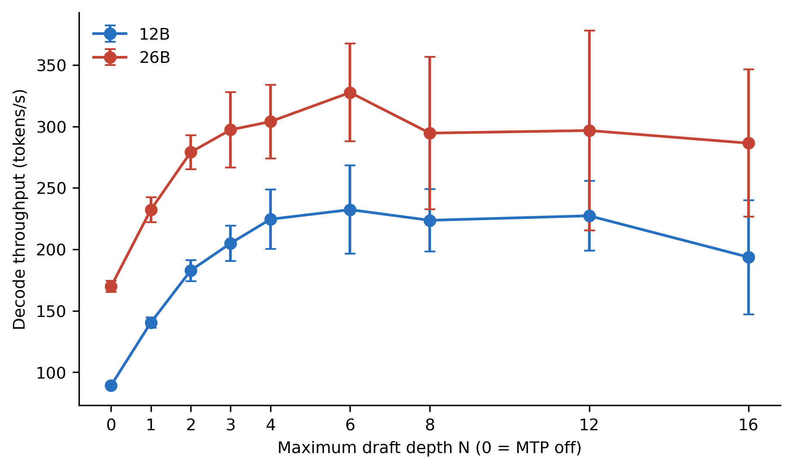{width=78%}

N=6 maximized aggregate throughput for both models. Relative to OFF, aggregate
ratios were 2.54x for 12B and 1.90x for 26B-A4B. Both also passed the pre-set
20% practical-acceleration threshold. Throughput fell or plateaued beyond N=6,
while acceptance generally declined. For 12B, N=6 proposed 3,077 draft tokens
and accepted 1,775 (57.7%); for 26B-A4B it proposed 2,626 and accepted 1,853
(70.6%). N=16 did not maximize either workload.

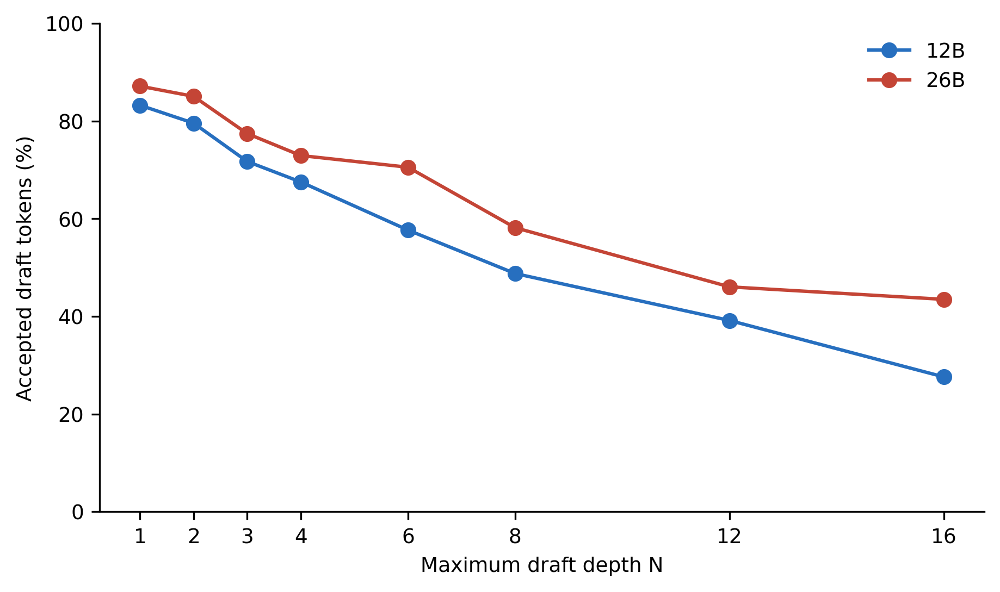{width=78%}

TTFC changed little relative to baseline at the maximum point, whereas
full-request latency fell substantially because 256 output tokens completed
faster. The higher CV at N=6 explains why the frozen conservative rule returned
no winner. Interpreting differences among nearby high-N points requires caution
because variation was not negligible. In the post-review prompt bootstrap,
12B N=6 was fastest in 51.3% of resamples, versus 29.4% for N=12, 13.5% for
N=8, and 5.8% for N=4. The paired median speed ratio of N=6 to N=12 was 1.066,
with a 95% prompt-bootstrap interval of [0.803, 1.202]. For 26B-A4B, N=6 was
fastest in 93.9% of resamples; its paired median ratio to runner-up N=4 was
1.019 [0.972, 1.310]. Thus N=6 is the observed grid maximum for both models,
but its advantage over neighboring depths is not resolved as a population
ordering, especially for 12B.

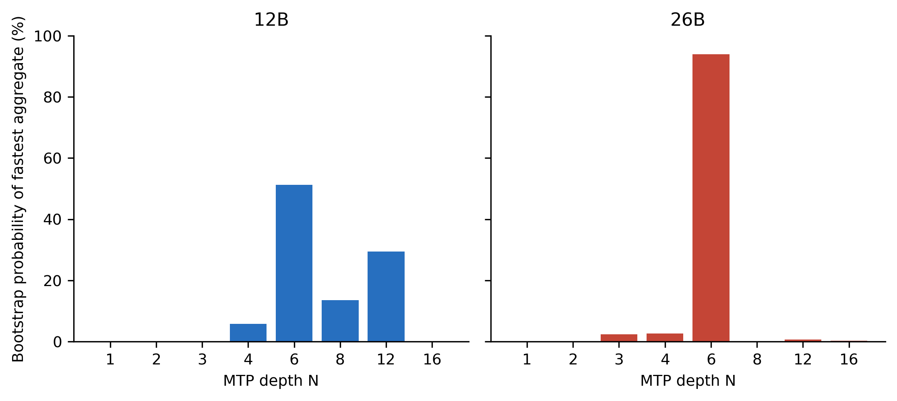{width=82%}

The observed 12B performance band defined by the frozen 95%-of-maximum speed
threshold contained four, not three, depths:

| 12B N | Aggregate tok/s | Share of observed max | CV | 200-item objective quality |
|---:|---:|---:|---:|---|
| 4 | 221.69 | 97.92% | 10.80% | Not evaluated |
| 6 | **226.39** | **100.00%** | 15.49% | Evaluated; margin cleared |
| 8 | 220.67 | 97.47% | 11.31% | Not evaluated |
| 12 | 223.30 | 98.63% | 12.44% | Not evaluated |

This supports a 12B **performance-tuning plateau** at N={4,6,8,12}. It does
not support treating all four as quality-equivalent or interchangeable:
N=4, N=8, and N=12 did not receive the paired 200-item objective evaluation,
and none passed the full conservative rule because every CV exceeded 10%.
N=6 therefore remains the quality-evaluated high-throughput default; N=3
remains the quality-evaluated lower-variance alternative.

# 7. Deterministic-equivalence results

Ordinary decoding reproduced exactly on 200/200 quality items for 12B and
199/200 for 26B-A4B. The one unstable 26B item is retained in the overall data
but excluded from stable-subset claims.

At N=6, 12B matched OFF byte-for-byte on 112/200 outputs (56.0%); 26B-A4B
matched on 118/200 (59.0%), or 117/199 (58.8%) among stable baselines. Target
token equality had the same rates. Median first divergence among divergent
sequences was token 42 for 12B and 37.5 for 26B-A4B. Mean normalized character
similarity remained 0.851 and 0.869, respectively, and median output-length
difference was zero. The lower-variance conditions did not restore exactness:
12B N=3 matched 55.0%, and 26B-A4B N=4 matched 59.0%.

On the nine forced-length performance prompts, 12B N=6 matched none of the OFF
outputs; 26B-A4B N=6 matched one of nine. The independent stable baseline makes
the quality-suite divergences sufficient to reject exact behavioral
equivalence for this stack.

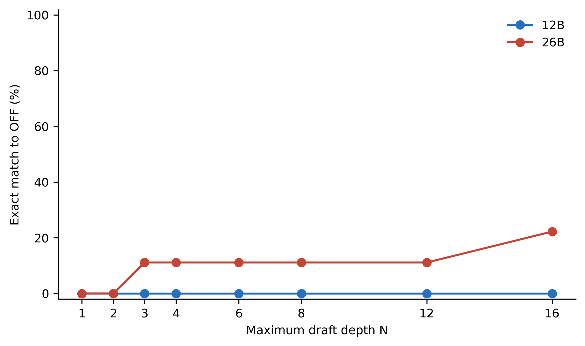{width=78%}

The divergence result is not a quality result. Autoregressive branching can
produce different but equally valid completions after one token changes. The
sequence-level metrics are therefore reported separately from correctness.

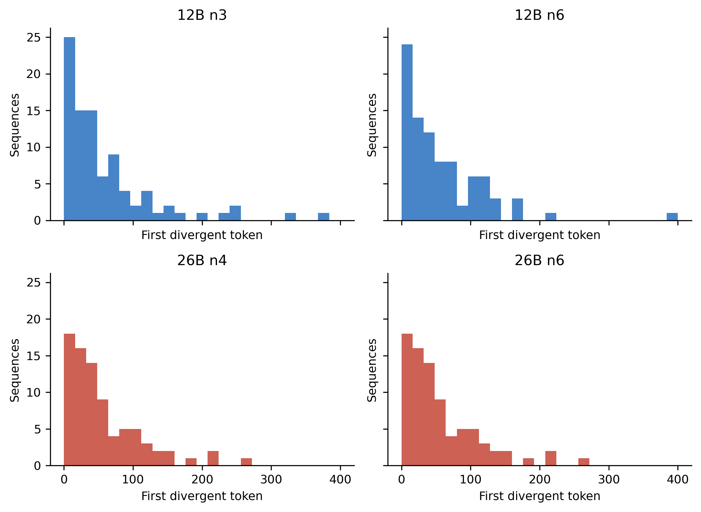{width=82%}

The post-review length analysis revealed a strong descriptive gradient. At
N=6, 12B matched 60/61 OFF outputs of 1--8 tokens and all 12 outputs of 9--32
tokens, but only 24/98 outputs of at least 129 tokens. For 26B-A4B, the
corresponding counts were 61/61, 5/6, and 22/88. Spearman correlations between
OFF length and exact equality were -0.703 for both N=6 conditions (unadjusted
exploratory p-values below $10^{-30}$). Exact pairs had median OFF length five
tokens, whereas divergent pairs had medians 235.5 (12B) and 220.5 (26B-A4B).
The forced 256-token performance results are consistent with more opportunity
to diverge over a long continuation. However, short outputs here are dominated
by constrained-answer tasks while long outputs come from generative tasks.
The data therefore support an operational length association, not the causal
claim that every token carries an independent fixed divergence probability.

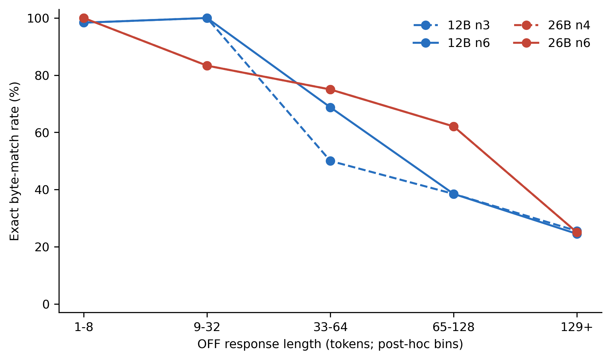{width=82%}

The second-review family-stratified analysis showed that the gradient was not
solely a between-family composition artifact. At N=6, within-family Spearman
correlations were -0.329, -0.566, and -0.701 for 12B and -0.321, -0.513, and
-0.643 for 26B-A4B in GSM8K, IFEval, and MBPP, respectively. All six 95%
pair-bootstrap intervals excluded zero, and all six exploratory BH-adjusted
p-values were at most 0.0135. MMLU-Pro could not identify a length association
because all 60 OFF outputs had length five.

After centering length rank and equality within the three variable-length
families, the pooled N=6 correlations were -0.490 [95% stratified-bootstrap CI
-0.610, -0.343] for 12B and -0.450 [-0.581, -0.297] for 26B-A4B. Both
within-family permutation tests reached the minimum attainable two-sided
Monte Carlo p-value of 0.000010 with 100,000 permutations, unchanged by BH
correction across the four retained comparisons.

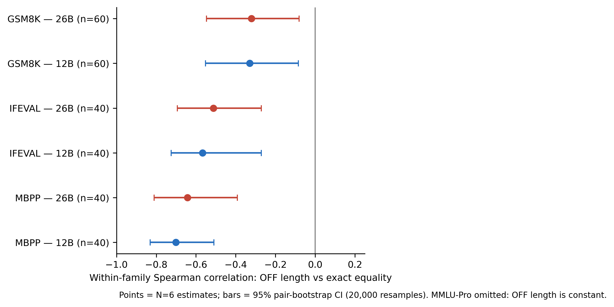{width=86%}

# 8. Objective task-quality results

| Model | Condition | GSM8K | MMLU-Pro | IFEval | MBPP | Macro | Macro change (pp) | 95% CI (pp) |
|---|---|---:|---:|---:|---:|---:|---:|---:|
| 12B | OFF | 93.33 | 56.67 | 85.00 | 85.00 | 80.00 | -- | -- |
| 12B | N=3 | 93.33 | 55.00 | 87.50 | 82.50 | 79.58 | -0.42 | [-3.33, +2.50] |
| 12B | N=6 | 91.67 | 55.00 | 90.00 | 80.00 | 79.17 | -0.83 | [-4.17, +2.71] |
| 26B-A4B | OFF | 88.33 | 61.67 | 87.50 | 85.00 | 80.63 | -- | -- |
| 26B-A4B | N=4 | 90.00 | 61.67 | 85.00 | 82.50 | 79.79 | -0.83 | [-2.92, +0.83] |
| 26B-A4B | N=6 | 90.00 | 61.67 | 85.00 | 82.50 | 79.79 | -0.83 | [-2.92, +0.83] |

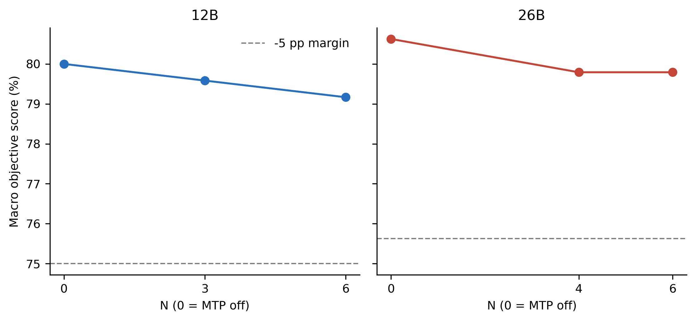{width=82%}

All four MTP comparisons cleared the frozen -5-point lower-bound rule. At N=6,
12B had six regressions and four improvements across the 200 paired items;
26B-A4B had two regressions and one improvement. The macro score differs from
the raw 200-item micro proportion because task families are equally weighted.
Every family-level exact McNemar p-value became 1.0 after within-model Holm
correction. Thus, this pilot found no statistically established family-level
effect, while its uncertainty permits small harms or gains.

There were length-capped responses even with corrected budgets: six for each
12B OFF repeat, nine at 12B N=6, seven at N=3, and four in each 26B-A4B
condition. They were retained and scored under the fixed rules. Parse,
execution, timeout, and truncation outcomes were not silently dropped.

# 9. Dense and MoE model-level association

The 12B dense model realized the larger relative acceleration at N=6 (2.50x
paired median; 2.54x aggregate) despite a lower draft acceptance rate (57.7%).
The 26B-A4B model realized a smaller relative gain (1.86x paired median; 1.90x
aggregate) with 70.6% acceptance. The absolute OFF decode rate was already
higher for 26B-A4B, consistent with its sparse active computation, but the
experiment did not hold model size, training, active parameters, or kernels
constant. One plausible systems interpretation is that the already-fast MoE
baseline leaves less relative serial work for batched verification to remove,
despite high draft acceptance. This mechanism was not isolated. These are
model/runtime associations, not proof that MoE architecture causes a smaller
MTP speedup.

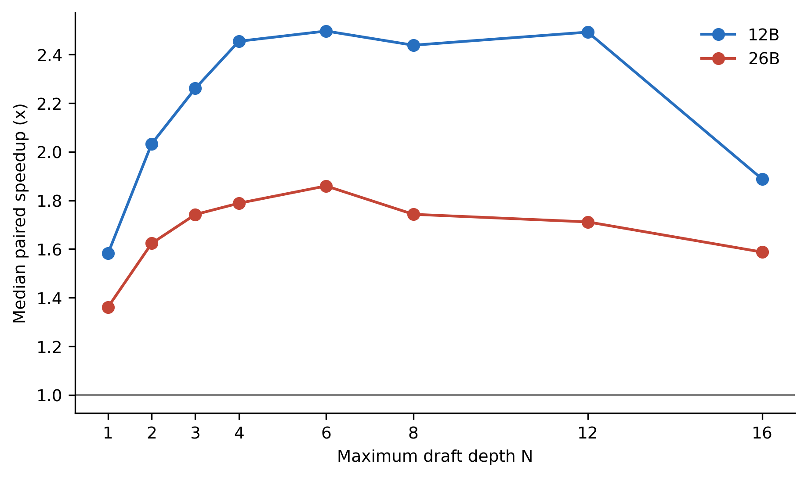{width=78%}

# 10. Quality--throughput Pareto analysis and operating points

On the measured objective suite, N=6 is the fastest tested condition whose
paired CI clears the frozen non-inferiority margin for both models. It is the
**quality-constrained maximum-throughput point**, not a universal optimum.
For 12B, N={4,6,8,12} form an observed performance plateau under the 95%
threshold, but only N=6 is quality constrained by the 200-item evidence.

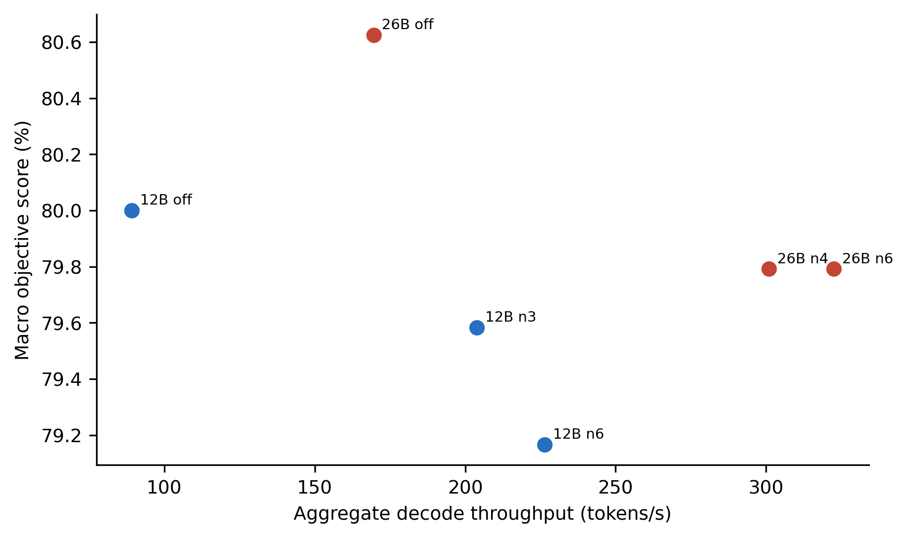{width=78%}

For lower run-to-run variation, 12B N=3 (203.91 tokens/s, CV 7.0%) and
26B-A4B N=4 (300.92 tokens/s, CV 9.8%) are reasonable exploratory operational
alternatives. Neither is formally the **conservative deployment point** under
the frozen rule because each fell below 95% of the N=6 aggregate maximum.
Moreover, neither reduced output divergence. The study therefore reports “no
eligible strict conservative point” rather than changing the rule after seeing
the data.

# 11. Exploratory p-min sweep

The optional phase was triggered because N at least 6 reached 90% of each
model's maximum. We evaluated 144 additional valid requests. For 12B, the best
exploratory combination was N=12, p-min=0.75 at 230.25 tokens/s, only 1.70%
above the N=6, p-min=0 reference and with CV 17.2%. For 26B-A4B, N=6,
p-min=0.50 reached 330.50 tokens/s, 2.47% above reference, with CV 10.3%.

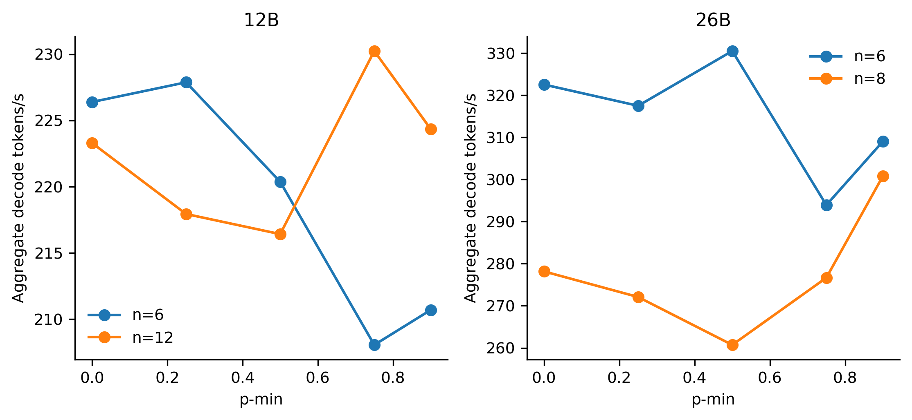{width=82%}

Because these percentage gains are small relative to observed variation and
the p-min conditions did not receive the 200-item quality evaluation, neither
replaces the primary N=6 recommendation. The 26B-A4B p-min=0.50 result is a
candidate for a preregistered replication.

# 12. Negative controls and contamination limits

The ordinary baseline repeat was exact for all 12B items and all but one 26B
item, showing that widespread OFF instability does not explain the MTP
divergence. In the 20-item option-order perturbation, 12B semantic-option
stability versus original order was 65% under OFF and 60% under N=6; the
perturbed MTP text matched perturbed OFF in 19/20 cases. For 26B-A4B, semantic
stability was 65% for both and MTP matched OFF in 20/20 cases. These small
controls show prompt-order sensitivity but no distinctive MTP failure signal.

No exact prompt duplicates were found. A conservative normalized 13-gram scan
found four shared substantive phrases after wrapper removal. Such diagnostics
cannot determine whether public benchmark items occurred in training. The
paired intervention comparison is less sensitive to shared contamination than
an absolute model-quality claim, but training exposure remains unresolved.

# 13. Discussion

The primary practical result is that MTP moved both models well beyond the
pre-set acceleration threshold while retaining objective scores within the
exploratory non-inferiority margin. For single-stream, 256-token continuations
on this GPU, N=6 is a defensible evidence-backed default. The depth conclusion
is asymmetric: 26B-A4B N=6 was the prompt-bootstrap winner in 93.9% of
resamples, whereas 12B has a broad measured performance plateau at
N={4,6,8,12}. Operators re-tuning 12B for a different workload can benchmark
that band, but N=4, N=8, and N=12 cannot inherit N=6's objective-quality result.

The behavioral result is equally important: exact greedy text cannot be
promised for these Q4_0 target/drafter pairs in this runtime. Byte/token match
rates near 56--59% on the quality suite are too low to dismiss as isolated
noise. Systems that require reproducible hashes, stable diffs, deterministic
audit trails, or cache keys derived from generated text should treat MTP as a
behavior-changing execution mode, even though task scores were stable here.
Within this suite, short constrained outputs were usually identical whereas
long generative outputs often diverged. That pattern is compatible with
cumulative opportunity for path-dependent numerical differences to alter a
continuation. The negative association remained within GSM8K, IFEval, and
MBPP, so between-family differences in average length and match rate are not a
sufficient explanation. Nevertheless, longer responses within each family can
proxy item complexity, response structure, stopping behavior, or truncation
exposure. The analysis therefore strengthens a descriptive length association
without isolating a causal per-token mechanism.

The quality finding should not be overstated. Passing a -5-point margin in 200
paired items supports a local deployment decision but does not prove identical
intelligence, semantic equivalence on every answer, or absence of smaller
systematic regressions. The open intervals contain both minor harm and minor
benefit. A larger confirmatory suite, preferably with private or recently
constructed tasks, is needed for narrower claims.

# 14. Limitations and threats to validity

**External validity.** The study covers one RTX 5070 Ti, one OS, one pinned
`llama.cpp` commit, QAT Q4_0 targets and drafters, concurrency one, context
8192, text-only inputs, and one fixed prompt/output distribution. It does not
cover BF16, other quantizations, multimodal inputs, long-context saturation,
high-concurrency service throughput, other GPUs, or other speculative runtimes.

**Measurement validity.** NVML failure prevented temperature, power, clock,
background-utilization, and independent peak-VRAM logging. Randomized condition
order, warm-up exclusion, per-run preservation, and variation reporting reduce
but do not eliminate thermal or system-load confounding. Streaming TTFC is
time to first content observed by the client, not a kernel-level first-token
measurement.

**Construct validity.** Objective benchmarks cover math, constrained
knowledge, verifiable instructions, and Python synthesis. They do not measure
open-ended Japanese prose, summarization quality, safety, factual calibration,
dialogue, or human preference. An uncalibrated LLM-as-judge phase was
deliberately omitted. MMLU-Pro was grammar-constrained and therefore should not
be compared directly with canonical chain-of-thought leaderboard scores.

**Statistical conclusion validity.** Four families and 200 items provide a
pilot, not guaranteed power for sub-percentage effects. The margin is practical
and frozen, but a -5-point lower bound may still be too permissive for
high-stakes tasks. The N=6 lower bounds of -4.17 and -2.92 points exclude the
frozen -5-point margin but do not exclude smaller systematic losses. A tighter
margin requires a larger, use-case-specific suite. Performance confidence
intervals use only nine paired prompts per condition. The post-review prompt
bootstrap confirms that the 12B ordering among N=6, N=12, and nearby depths is
not secure; it also omits run-to-run and thermal uncertainty.

**Internal validity.** One 26B ordinary response was not reproducible. Stable
subset rates are reported. The condition-selection fallback was specified only
after the strict rule returned no eligible point, but before quality outputs
were examined; it is explicitly exploratory. Smoke-test corrections to output
budgets, reasoning-channel parsing, and constrained MMLU output are fully
versioned, but they weaken confirmatory framing.

**Mechanism.** No higher-precision control or kernel trace was run. The study
cannot attribute divergence to quantization alone, nor can it determine whether
the behavior is fixed in a later runtime. The response-length analysis was
post-review. Task-family stratification removes between-family level
differences but not within-family complexity, response-form, stopping, or
truncation confounding; its descriptive survival estimate may also have
informative censoring at natural endings. It does not distinguish quantization,
kernel ordering, verification batching, or KV/state management.

# 15. Reproducibility

The private internal archive contains the frozen protocol, environment and
model hashes, fixed prompts, source revisions, launch scripts, append-only raw
JSONL, complete server logs, deterministic scorer code, processed CSV/JSON,
publication figures, and validation reports. The separate public
reproducibility archive omits verbatim benchmark items, generated response
text, complete logs, local paths, and vendored third-party source. It retains
task identifiers, hashes, measurements, processed results, pinned upstream
revisions, retrieval code, and reproducibility instructions. The public
redistribution audit documents every excluded field and directory. Raw
evidence is hashed in the private archive; public artifacts are hashed
separately. The original preliminary benchmark remains outside this study root
and was not modified. The post-review analysis is regenerated by
`scripts/analyze_review_followup.py`; its status and caveats are embedded in
the output JSON.

Because source model paths are machine-local and the model artifacts are large,
another operator must supply byte-identical files or update paths and treat the
result as a replication condition. Re-running against a newer `llama.cpp`
commit is also a replication, not a direct reproduction.

# 16. Ethics and AI-assistance disclosure

No human participants, private user logs, personal data, or human-subject
interventions were used. Generated Python was executed only in a constrained
local sandbox. Public benchmark licenses and source provenance remain the
responsibility of any redistributor of the artifact package.

OpenAI Codex assisted with experimental scripting, execution orchestration,
data-processing and research engineering, analysis, visualizations, manuscript
language preparation, and dissemination preparation. All quantitative
statements in the paper are derived from machine-readable outputs and
validation scripts. AI systems are not authors. The human author, Taiko Toeda,
is responsible for the research design, measurements accepted for publication,
interpretation, citations, claims, attribution, venue compliance, and the final
publication decision.

# 17. Conclusion

For the tested QAT Q4_0 Gemma 4 stack on an RTX 5070 Ti, MTP at N=6 raised
aggregate decode throughput from 89.20 to 226.39 tokens/s for 12B and from
169.58 to 322.53 tokens/s for 26B-A4B. The paired 200-item objective suite
cleared a frozen -5-point non-inferiority margin, with observed macro changes
of -0.83 points for both models. Yet only 56% and 59% of selected MTP outputs
were exactly identical to ordinary decoding. The evidence therefore supports
a precise deployment statement: MTP is substantially faster and did not show
a meaningful objective-quality loss under this pilot, but it is not
behaviorally identical in this quantized runtime. N=6 is the measured
quality-constrained observed maximum in this grid; its near-depth ranking is
not definitive, particularly for 12B. The 12B performance-only plateau is
N={4,6,8,12}, but only N=6 in that band has the objective-quality evidence;
N=3 is the quality-tested lower-variance alternative. For 26B-A4B, N=6 is the
more robust depth winner and N=4 is the lower-variance alternative. None is a
formal conservative winner. Higher-precision, cross-runtime, and
length-balanced replication remain the highest-value next tests.

# Appendix A. Exact launch configuration

The common server settings were equivalent to:

```bash
llama-server \
  --model TARGET.gguf \
  --ctx-size 8192 --parallel 1 \
  --flash-attn on --cache-type-k f16 --cache-type-v f16 \
  --batch-size 512 --ubatch-size 512 --threads 8 \
  --n-gpu-layers 999 --fit off --jinja \
  --reasoning off --reasoning-format deepseek
```

MTP conditions additionally supplied the pinned Q4_0 drafter and:

```bash
--spec-type draft-mtp \
--model-draft DRAFTER.gguf \
--n-gpu-layers-draft 999 \
--spec-draft-n-max N \
--spec-draft-p-min 0
```

Requests used temperature 0, top-k 1, fixed seeds, and
`reasoning_budget_tokens=0`. The performance phase used `ignore_eos=true` and
`max_tokens=256`. Exact executable paths and scripted invocations are given in
`REPRODUCE.md`.

# Appendix B. Evidence map

- Full performance grid: `processed/performance_summary.csv`
- Request-level performance: `processed/performance_runs.csv`
- Quality family scores: `processed/quality_summary.csv`
- Paired score changes and tests: `processed/paired_quality_changes.csv`
- Sequence equivalence: `processed/equivalence_summary.csv` and
  `processed/equivalence_pairs.csv`
- Exploratory p-min: `processed/pmin_summary.csv`
- Post-review length association: `processed/length_divergence_by_bin.csv`,
  `processed/divergence_survival.csv`, and
  `processed/review_followup_analysis.json`
- Second-review within-family length association:
  `processed/length_divergence_within_family.csv` and
  `processed/length_divergence_stratified.csv`
- Post-review depth-rank bootstrap: `processed/depth_rank_uncertainty.csv`
- 12B observed performance plateau: `processed/12b_performance_plateau.csv`
- Negative control: `processed/negative_control_summary.csv`
- Deviations: `analysis/DEVIATIONS.md`
- Environment: `configs/environment.json` and `ENVIRONMENT.md`

# References
